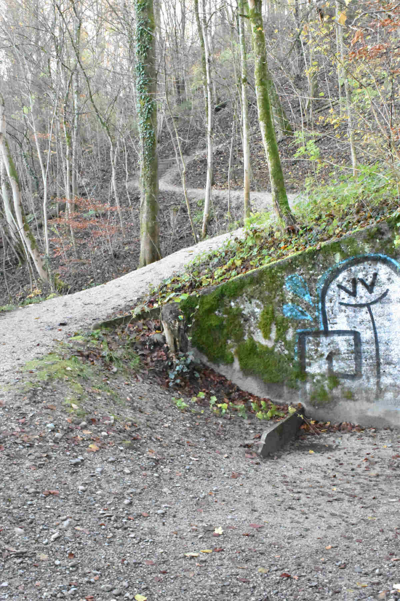
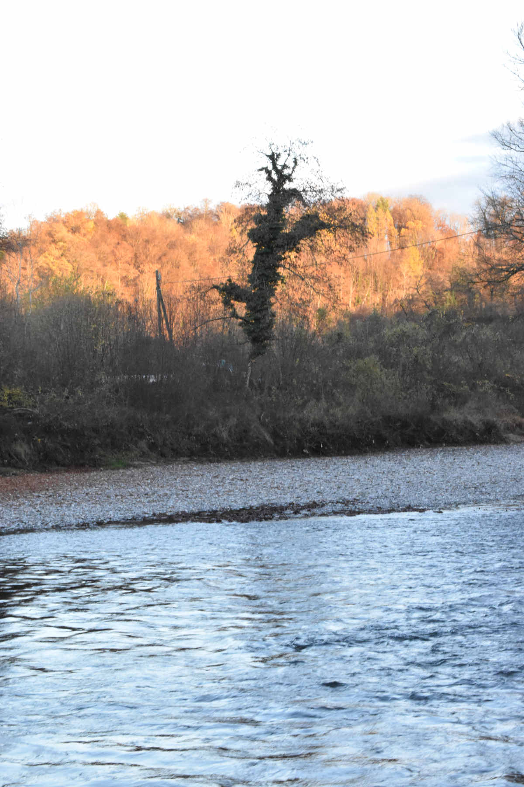
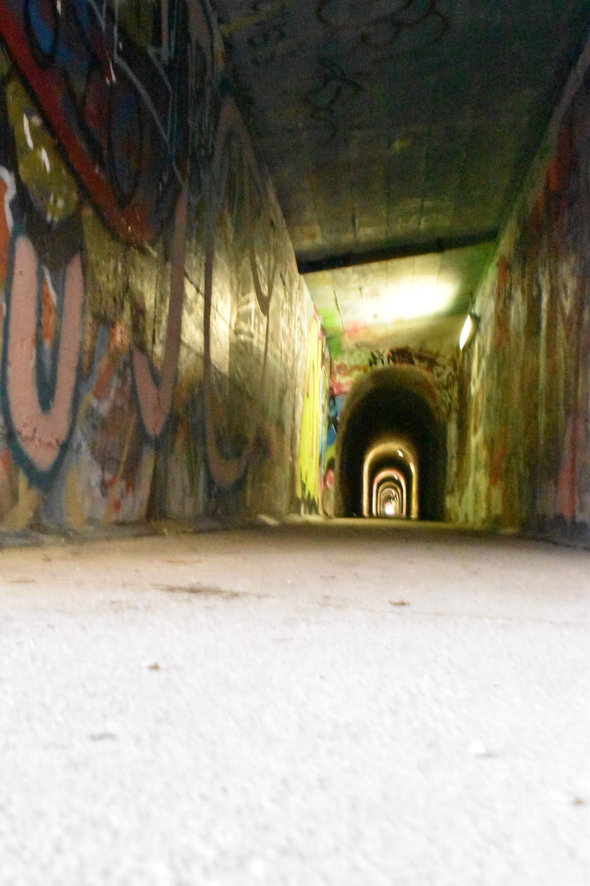

+++
title = "Bildserie Kontraste"
date = "2021-02-24"
draft = false
pinned = false
image = "weg-mit-graffiti-für-blog.jpg"
description = "Eine Fotoserie von verschiedenen Kontrasten. Von Licht und Schatten bis zu Natur und Künstlichem."
+++
Eine Fotoserie von verschiedenen Kontrasten. Von Licht und Schatten bis zu Natur und Künstlichem.

Meine Fotografien sollen sehr authentisch wirken sowie die verschiedenen Kontraste sehr einfach veranschaulichen.

Für diese Aufnahme eines Licht-Schatten-Kontrasts habe ich am späten Nachmittag die Natur an der Aare fotografiert. Für alle meine Fotografien habe ich kein Stativ oder sonstige Requisiten verwendet. Die Belichtungszeit ist dementsprechend sehr kurz. Die hier zu betrachtenden Bilder habe ich ohne Verwendung des Blitzes der Kamera geschossen. 

In diesem Bild musste ich den ISO-Wert sehr hoch einstellen. Dadurch ist leider das ganze Bild sehr unscharf geworden. Um dies zu vermeiden würde ich den ISO-Wert der Kamera ganz normal belassen und dafür die manuelle Helligkeit des Fotoapparats erhöhen.