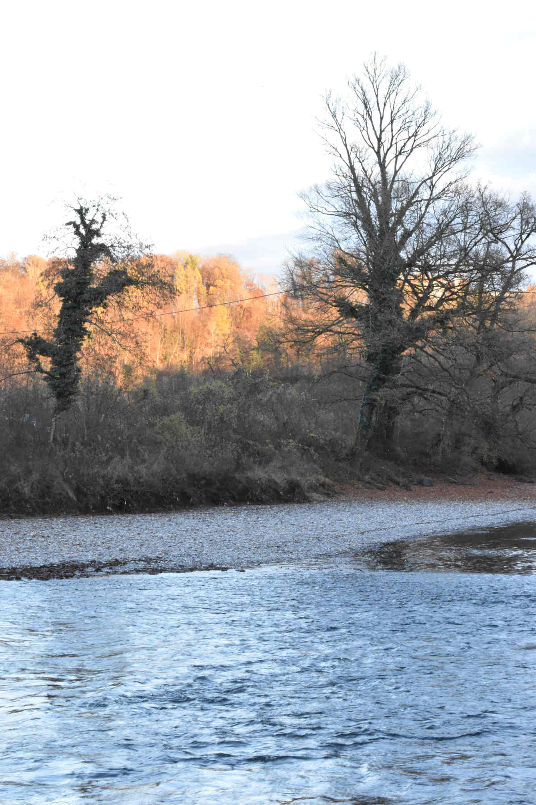

+++
title = "Bildserie Kontraste"
date = "2021-02-24"
draft = true
pinned = false
image = "weg-mit-graffiti-für-blog.jpg"
description = "Eine Fotoserie von verschiedenen Kontrasten. Von Licht und Schatten bis zu Natur und Künstlichem."
+++
Bei meinen Bildern ist es sehr wichtig, dass der Kontrast sehr gut sichtbar ist, sowie dass mein Foto authentisch wirkt. 

